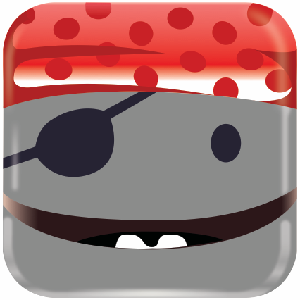

<h3> Bip, Bip, Yarrh! </h3>

# RobotPiraten
Jeg er robotpiraten til slak kanalen for [Coding Pirates](codingpirates.dk).

Mine opgaver er at byde de nye medlemmer velkommen, tjekke at folk har udfyldt
deres profil oplysninger og hvad folk ellers kan finde på til mig.


#### Hvad kan jeg nu?:
- [x] Poste i annonceringer hver gang en ny kanal åbnes.
- [x] Byde nye medlemmer velkommen
- [x] Tjekke om folk har udfyldt deres profiloplysninger
- [ ] Sende invitationer til nye medlemmer

#### Hvad har jeg brug for?
- En bot api token
- En user api token (legacy token)
- Slack skal kende min webadresse
Under "Interactive Components" skal webadressen jeg bor på indtastes med "/command" efter.
På den måde, kan Slack tale med mig.

#### Har du lyst til at kode på mig?
Så kod i filen `lib/robot-pirat.js`, robotpiraten benyttter sig af dette
node modulet [slackbots](https://www.npmjs.com/package/slackbots) som gør det
nemmere at arbejde med [Slack API'en](https://api.slack.com/rtm).

Hvis du har nogle spørgsmål, eller skal bruge en API token for at teste, så
skriv til `@rotendahl` på slack.

For at starte mig kør kommandoen

```bash
$ npm start
```
